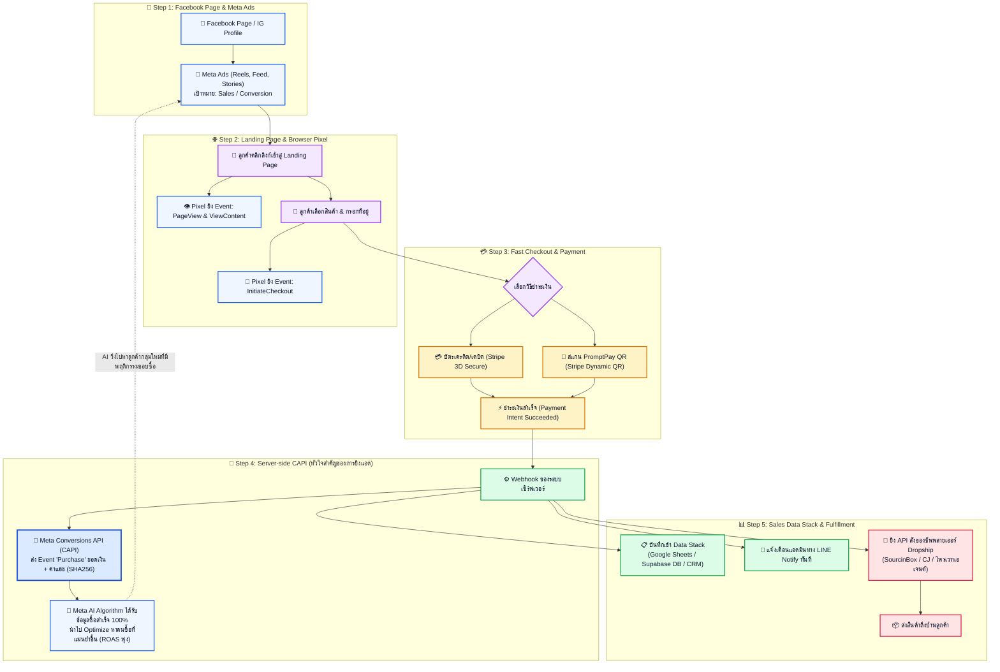

# แผนภาพ Flow: Meta Ads + Landing Page + Stripe + Meta Conversions API (CAPI)


เอกสารนี้สรุปภาพรวมสถาปัตยกรรมการตลาด การเก็บข้อมูลการขาย (Data Stack) และการยิงแอด Meta เพื่อให้ AI ของ Facebook เรียนรู้และหาลูกค้าที่พร้อมจ่ายเงินได้อย่างแม่นยำสูงสุด

---

## 1. แผนภาพ Flow รวมทั้งระบบ (End-to-End System Flow)



---

## 2. ทำไมต้องใช้ "Meta Pixel + Conversions API (CAPI)" คู่กัน?

ในปัจจุบัน ยุค iOS 14+ และเบราว์เซอร์ที่มี Ad Blocker **Pixel ในเว็บเบราว์เซอร์จะตรวจจับออเดอร์หายไปถึง 30–40%** ทำให้ Facebook ไม่รู้ว่าใครเป็นคนซื้อ และเสียเงินค่าแอดไปฟรีๆ

การติดตั้ง **Data & Tracking Stack แบบ Full-funnel** จะแก้ปัญหานี้อย่างถาวร:

| ระดับ | ช่องทาง | Events ที่ส่ง | ความปลอดภัย & ความแม่นยำ |
| :--- | :--- | :--- | :--- |
| **Client-side (หน้าเว็บ)** | Meta Pixel (JavaScript) | `PageView`<br>`ViewContent`<br>`InitiateCheckout` | ทำงานบนเบราว์เซอร์ลูกค้า เก็บข้อมูลพฤติกรรมการเลื่อนดูเว็บ |
| **Server-side (หลังบ้าน)** | **Meta Conversions API (CAPI)** | **`Purchase` (สั่งซื้อสำเร็จ)** | ยิงตรงจากเซิร์ฟเวอร์เราเข้า Meta โดยตรง **ไม่มี Ad Blocker ตัวไหนบล็อกได้** วัดผลได้ 100% |

### ค่าที่ส่งให้ Meta CAPI เพื่อให้ได้ Event Match Quality (EMQ) สูงถึง 9/10:
* **Hashed Phone Number (`ph`)**: เบอร์โทรที่ลูกค้ากรอก นำมาแปลงเป็น SHA256
* **Hashed Email (`em`)**: อีเมลลูกค้านำมาแปลง SHA256
* **Hashed Name (`fn`, `ln`)**: ชื่อ-นามสกุล
* **Client IP & User Agent**: หมายเลข IP และอุปกรณ์
* **Facebook Click ID (`fbc`) & Browser ID (`fbp`)**: รหัสติดตามการคลิกจากโฆษณา
* **Value & Currency**: ยอดเงินจริง (เช่น `1290.00 THB`)

> เมื่อ Meta CAPI จับคู่คนซื้อกับผู้ใช้ใน Facebook/IG ได้ถูกต้อง AI จะคำนวณ **ROAS (Return On Ad Spend)** ในตัวจัดการโฆษณา (Ads Manager) ได้แม่นยำ และปรับลดค่าโฆษณาต่อการซื้อ (Cost per Purchase) ให้ถูกลงอย่างเห็นได้ชัด

---

## 3. Data Stack การเก็บข้อมูลการขาย (Customer Data Stack)

เมื่อมีลูกค้าชำระเงินผ่าน Stripe สำเร็จ ระบบหลังบ้านจะบันทึกข้อมูลแบบ 3 มิติ:

1. **Sales Performance Dashboard (Google Sheets / Database)**:
   - บันทึก: วันที่, รหัสออเดอร์, ชื่อลูกค้า, เบอร์โทร, ที่อยู่จัดส่ง, สินค้า/แพ็กเกจ, ยอดชำระ, รหัสแคมเปญ Meta Ad (UTM Campaign / Adset ID)
   - ช่วยให้รู้ทันทีว่า **"โฆษณาตัวไหนทำกำไร โฆษณาตัวไหนขาดทุน"**
2. **Instant Notification (LINE Notify / Telegram)**:
   - ข้อความเด้งเข้ามือถือคุณทันทีเมื่อมีเงินเข้า:
     ```text
     🎉 ได้รับออเดอร์ใหม่! ฿1,290
     สินค้า: แท่นชาร์จแม่เหล็ก 3-in-1 (ชุด 2 ชิ้น)
     ลูกค้า: คุณสมชาย (081-xxx-xxxx)
     ชำระ: PromptPay QR (Stripe)
     มาจากแอด: Campaign_Gadget_Reels_01
     ```
3. **Automated Dropshipping Trigger**:
   - ยิง API ออเดอร์และที่อยู่ลูกค้าไปยังซัพพลายเออร์เพื่อจัดส่งทันที
